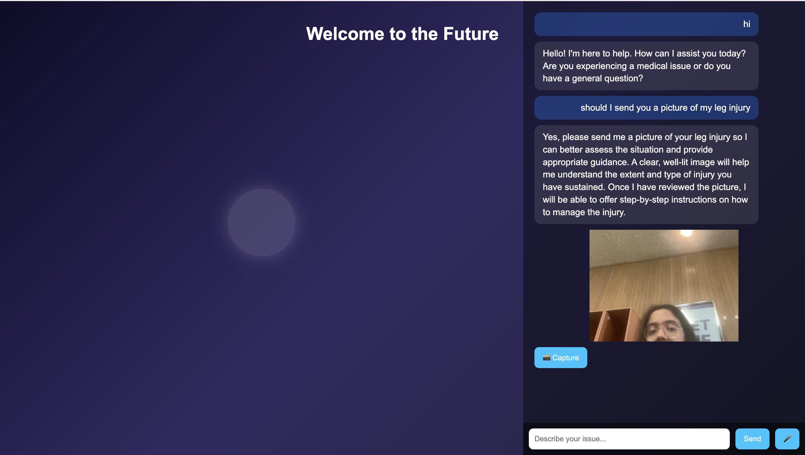

# 🧠 Medico

An intelligent, multimodal triage agent built using cutting-edge LLMs (Claude 3, Gemini, Groq) to provide real-time medical help during emergencies or general consultation using text, speech, and image inputs. Includes voice conversation support, live camera integration, and persistent memory of interactions.

---

## 🤝 Contributors

**Anushree Nema** – Full Stack & AI Developer

---

## 🚀 Features

- 🗣 **Voice + Text + Image Interaction**: Users can talk or type with the assistant. It also analyzes images of injuries via webcam.
- 📊 **Severity Detection (Groq)**: Automatically detects the seriousness of the case using Groq's LLM and modifies agent's behavior accordingly.
- 🧑‍⚕️ **Medical Memory**: Users can upload their medical history, which is saved for contextual, personalized assistance.
- 💬 **Conversational AI (Claude 3)**: Engages in human-like dialogue, gives step-by-step emergency instructions.
- 📷 **Real-Time Camera Analysis (Gemini)**: Assistant asks for images when needed and interprets the visual data in real time.
- 🧵 **Live Speech Transcription (Whisper)**: Allows for continuous voice-based conversation, split into intelligent 3s chunks for fast response.
- 💾 **Local DB Storage**: All conversations and user medical records are stored in a database for future reference.
- 🌐 **Modern Web Interface**: Clean, animated UI, responsive layout.

---

## 🏥 Use Case

In an emergency or general consultation, users often panic and struggle to get proper help. This project acts as a real-time AI agent that:

- Helps users assess and respond to medical crises.
- Understands natural language (spoken or typed).
- Reacts dynamically with image/video understanding.
- Saves prior medical data for more informed help.
- Lets users know whether to visit a doctor and what to do till then (general consultation).

---

## 🛠️ Tech Stack

| Category              | Technology / Tool                                  |
| --------------------- | -------------------------------------------------- |
| **Frontend**          | HTML, CSS, JavaScript                              |
| **Backend**           | Python (FastAPI)                                   |
| **LLMs**              | Claude 3 (Anthropic), Groq, Gemini                 |
| **Speech Processing** | OpenAI Whisper (STT), Web Speech API (TTS)         |
| **Image Analysis**    | Gemini Multimodal                                  |
| **Data Storage**      | SQLite / MongoDB (Pluggable)                       |
| **Voice UI**          | Web Speech API, SpeechSynthesis, SpeechRecognition |

---

## 🧪 How It Works

1. User opens the web app and sees a title animation ("Welcome to the Future").
2. They can:
   - Type or speak their medical situation.
   - Upload a medical image (e.g., wound, injury).
   - Open camera directly if prompted by the assistant.
3. The assistant (Claude 3) analyzes the query.
4. Groq classifies the severity.
5. Gemini checks if an image is needed.
6. Gemini multimodal analyzes any image provided.
7. The assistant responds via voice + text, asking guided questions.
8. All chat, media, and user details are saved to the DB.

---

## 📸 Screenshot: Patient Upload Feature

